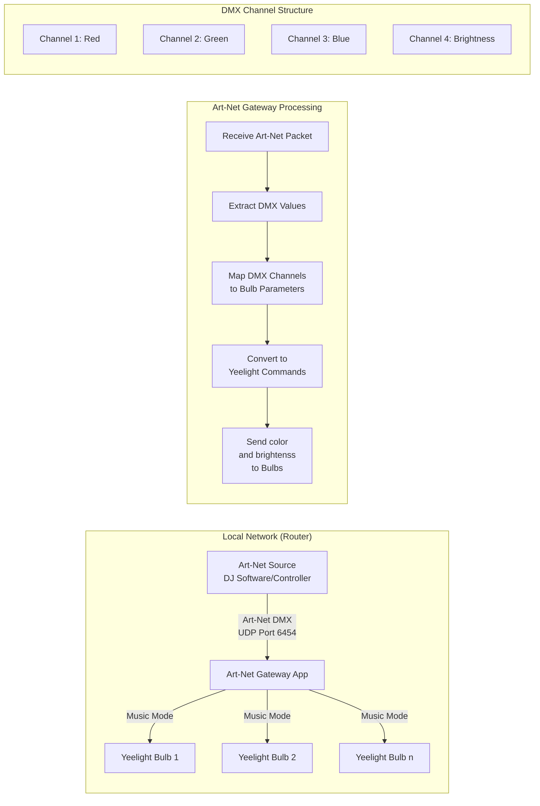
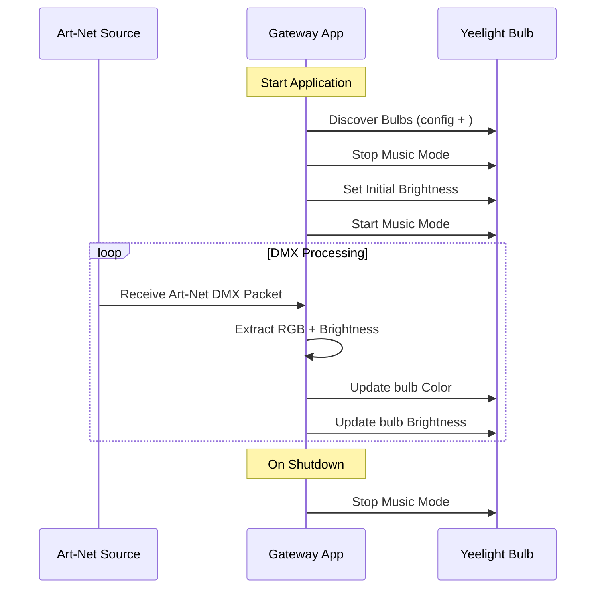

Art-Net to Yeelight Gateway
===========================

An application that receives Art-Net DMX data and controls Xiaomi Yeelight RGB smart bulbs, emulating LED RGB PAR lighting. This allows for visualizing music control signals from Engine DJ and integrates with SoundSwitch software, making each bulb appear as a dedicated device. The application uses "music mode" to communicate with the bulbs, ensuring low latency between music and light reactions. "Music mode" is like a long-running TCP connection with bulbs. Unfortunately, my smart bulbs don't show UDP capability.

Why? We have so many interesting smart things around us, but we use only a small part of their potential. I've had consumer smart bulbs by Yeelight (Xiaomi/Mi) for years and usually I just set up scenarios for morning/evening, asked voice assistance "Turn the orange color in the room. 100% brightness", but bulbs can be controlled in a much more fun way. While they're not always the fastest in reaction, they're sufficient to implement a light show. And there's a whole industry in light shows, with DMX, Art-Net (DMX over IP), and tools to create, edit, and control light shows. SoundSwitch can generate light changes based on music track analysis. So, why not use really cheap consumer electronics with battle-tested pro tools?

(Yes, you can find official integrations with expensive smart lights by Philips or Nanoleaf, but the Nanoleaf implementation by SoundSwitch is really poor to be honest - there's much more potential in how Nanoleaf can be controlled, oh, its another theme...)

* * * * *

Installation
------------

1. Clone the repository:
```bash
git clone https://github.com/clickfreak/artnet_to_smartbulbs.git
cd artnet_to_smartbulbs
```

2. Create and activate a virtual environment (recommended):
```bash
python -m venv venv
source venv/bin/activate  # On Linux/macOS
# or
.\venv\Scripts\activate  # On Windows
```

3. Install dependencies:
```bash
pip install -r requirements.txt
```
or
```bash
pip install yeelight aioartnet pyyaml
```

4. Configure your bulbs in `config.py` (see Configuration section below)

5. Run artnet source (EngineDJ, SoundSwitch, etc)

6. Run the gateway:
```bash
python artnet_gateway.py
```


Project Flow and Components
--------------------------



The gateway application acts as a bridge, converting Art-Net DMX data into Yeelight-compatible commands.

PC with running artnet_gateway must be connected in artnet network and to smart bulbs network. In my case is the same, its just mobile wifi router.


I choosed fixture for ADJ Dotz Par in 4 channel DMX mode to simplify operations. There is all i need: RGB + dimmer.
* * * * *

### Sequence Diagram



Configuration
------------

The application is configured through the `config.py` file. Here's how to set it up:

### Bulb Configuration

In `config.py`, you need to define your Yeelight bulbs in the `BULBS_INFO` list. Each bulb requires the following information:

```python
{
    'ip': '192.168.108.xxx',  # IP address of your Yeelight bulb
    'name': 'Bulb Name',      # Descriptive name for the bulb
    'dmx_start': 1           # Starting DMX channel for this bulb
}
```

Example configuration:
```python
BULBS_INFO = [
    {
        'ip': '192.168.108.131',
        'name': 'lamp_in_corner',
        'dmx_start': 1
    },
    {
        'ip': '192.168.108.149',
        'name': 'desktop lamp',
        'dmx_start': 5
    }
]
```

### DMX Channel Configuration

Each bulb uses 4 DMX channels:
- Channel 1: Red (0-255)
- Channel 2: Green (0-255)
- Channel 3: Blue (0-255)
- Channel 4: Brightness (0-255)

Important notes:
1. Bulb `dmx_start` value can be overlap with other bulbs if you have programmed less channels in artnet source than bulbs you have 
2. Make sure your computer can connect to the bulbs' IP addresses. This requires proper network routing. To simplify setup the devices should be on the same IP network or connected via WiFi. In my setup, the Art-Net source (Denon Prime Go with Soundswitch) and laptop with this artnet gateway is connected to a 5GHz WiFi network, while the Yeelight bulbs are on 2.4GHz (since they don't support 5GHz). However, both networks are managed by the same physical router, so the Art-Net source and bulbs are on the same IP network and Layer 2. Laptop must see artnet broadcast by artnet source and make possible to establish connection with bulbs
3. Smart Bulbs must be in dev/lan mode. Theoreticaly lan mode can be enabled in Yeelight Classic app, it this app stops to see my devices. So... If you are in the same situation and have configured bulbs in Mi Home app only then... Scary part where you need to enter your Xiaomi Account credentials (id/email + password) to get tokens for devices. (Yep, by default yeelight smart bulbs controlled via third-party cloud, not directly)

### Finding Your Bulb IP Addresses and Enabling API Control (The Scary Part)

How to use Xiaomi-cloud-tokens-extractor and then enable dev mode using miiocli
```
% git clone https://github.com/PiotrMachowski/Xiaomi-cloud-tokens-extractor
% cd Xiaomi-cloud-tokens-extractor
% python3 ./token_extractor.py
Username (email or user ID):
<your email or user ID>
Password:
<hidden>

Server (one of: cn, de, us, ru, tw, sg, in, i2) Leave empty to check all available:

...
Logging in...

<here is a list of your xiaomi devices, their IP addresses, tokens, names...>

Devices found for server "cn" @ home "329491":
   ---------
   NAME:     Fireplace top light
   ID:       811203345
   MAC:      C4:93:BB:1F:6B:56
   IP:       192.168.100.132
   TOKEN:    79a097d33d30c918b9b7a4c138beefdc
   MODEL:    yeelink.light.color5

```

```
miiocli yeelight --ip 192.168.100.132 --token <TOKEN> set_developer_mode 1
```

### Other Configuration Parameters

Additional parameters in `config.py`:
- `DMX_START_ADDRESS`: Starting DMX address (default: 1)
- `CHANNELS_PER_BULB`: Number of DMX channels per bulb (default: 5) - not really used, but propagated
- `INPUT_FLOWS`: Number of input flows (default: 2)

### Testing Your Configuration

1. Make sure all configured bulbs are powered on and connected to the network
2. Run the application: `python artnet_gateway.py`
3. Check the logs for successful bulb discovery and connection
4. If any bulbs fail to connect, verify their IP addresses and network connectivity. Debug it somehow :)

Sometimes a bulb can get stuck in an unresponsive state. This can be fixed by a power reset (power off -> wait -> on) or just waiting for an internal reset (no guarantees at all).

# Ideas

- Implement integration with other consumer smart bulbs from different companies and ecosystems. It could be some kind of backend system, like utilizing the HomeAssistant API to control home lights for party needs.
- Sound-activated integrated Art-Net source, to be able to throw a rave with any sound system. Analyze the sound from a microphone and convert it into a simple light show by frequency ranges - a laptop CPU is more than enough for basic sound processing :) Maybe this is already implemented in some Art-Net-related apps, I just don't know.

Don't hesitate to ask me questions :) And send PRs :D