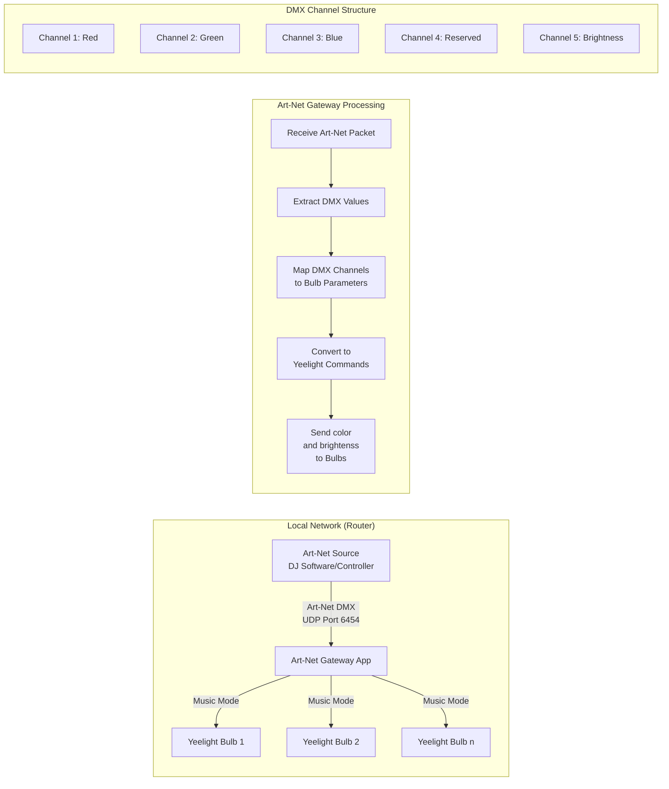
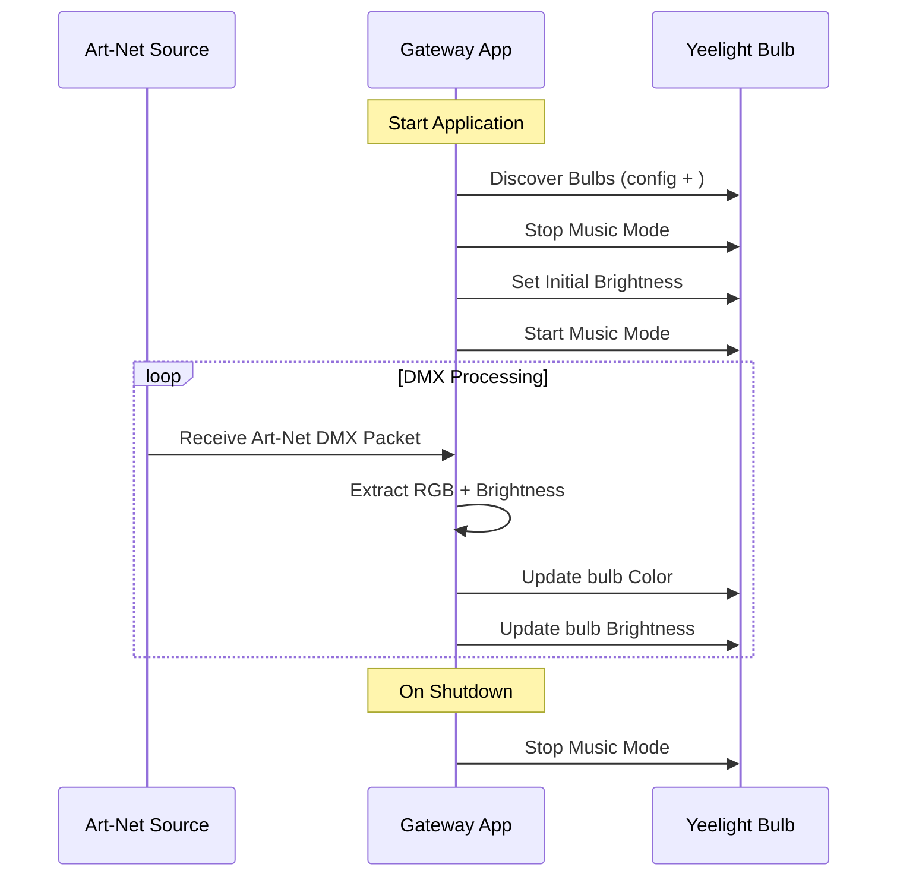

Art-Net to Yeelight Gateway
===========================

An application that receives Art-Net DMX data and controls Xiaomi Yeelight RGB smart bulbs, emulating LED RGB PAR lighting. This allows for visualizing music control signals from Engine DJ and integrates with SoundSwitch software, making each bulb appear as a dedicated device. The application trying to use "music mode" to communicate with the bulbs, ensuring low latency between music and light reactions. "music mode" is like long running tcp connection with bulbs. Sad, my smart bulbs doesn't show udp capability.

* * * * *

Project Flow and Components
--------------------------

The gateway application acts as a bridge, converting Art-Net DMX data into Yeelight-compatible commands.

PC with running artnet_gateway must be connected in artnet network and to smart bulbs network. In my case is the same, its just mobile wifi router.
* * * * *

### Sequence Diagram

